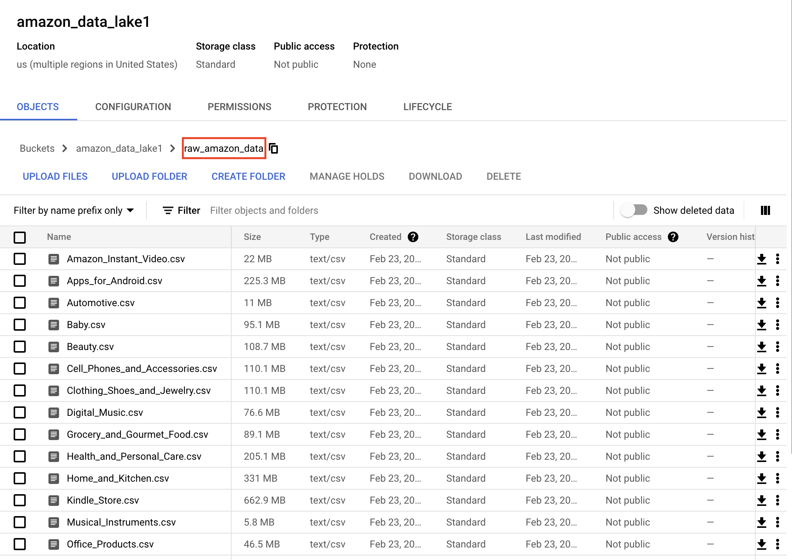

# Amazon Product Review Classification
An end-to-end ML pipeline that aims to classify positive
and negative reviews from the customers over different Amazon products.

# Table of Contents
- [Amazon Product Review Classification](#amazon-product-review-classification)
- [Table of Contents](#table-of-contents)
- [Project Objective](#project-objective)
- [Proposed Problem Statement](#proposed-problem-statement)
- [Tech Stack and Frameworks](#tech-stack-and-frameworks)
  - [Python Packages](#python-packages)
- [Data](#data)
- [EDA](#eda)
- [Data Preprocessing](#data-preprocessing)
- [Model](#model)
  - [Metrics](#metrics)
  - [Baseline Models](#baseline-models)
  - [Inferencing](#inferencing)
- [Architecture](#architecture)
  - [Model Training](#model-training)
  - [Storage](#storage)
  - [Application](#application)
  - [Deployment](#deployment)
- [Data Pipeline](#data-pipeline)
  - [Clean data](#clean-data)
  - [Raw data](#raw-data)
- [References](#references)
- [Credits](#credits)
- [Future of Work](#future-of-work)


# Project Objective
1. To build an end-to-end ML pipeline with focus on learning and utilising new MLOps tools, and to productionize completed ML solution on cloud platform.

2. To explore existing data engineering tools to create a data pipeline that could automatically ingest data into cloud storage. 

# Proposed Problem Statement
Customer Product Review Classification: To classify product reviews `negative`/`positive`.

# Tech Stack and Frameworks
Python 3.8, Docker, MLFLow, Airflow, Flask API, CSS/HTML, Google Cloud Platform, Heroku

## Python Packages
These are some of the notable python packages utilized:
- matplotlib, scikit-learn, imbalanced-learn, nltk


# Data
Amazon product dataset containing at least ~19 million product reviews from Amazon, ranging from 24 product categories. Full downloadable resources could be found [here](http://jmcauley.ucsd.edu/data/amazon/index_2014.html). For ML pipeline side of the project, the category "Clothing, Shoes and Jewelry" were used to train on the model. For Data pipeline, all 20+ files were involved. More details for Data pipeline over [here](...)

The raw data downloaded from [source](http://jmcauley.ucsd.edu/data/amazon/index_2014.html) was a `.gz` format, and after running below, a `.json` file is unzipped. 

```shell
gunzip --keep {reviews_Clothing_Shoes_and_Jewelry_5.json.gz}
```

Below is a snippet on how to extract data from `.gz` to `pandas.Dataframe` conveniently. 

```python
import pandas as pd
import gzip

def parse(path):
  g = gzip.open(path, 'rb')
  for l in g:
    yield eval(l)

def get_dataframe(path):
  i = 0
  df = {}
  for d in parse(path):
    df[i] = d
    i += 1
  return pd.DataFrame.from_dict(df, orient='index')

df = get_dataframe('reviews_Clothing_Shoes_and_Jewelry_5.json.gz')
```

A sample row of record from a `pandas.Dataframe` as below:
| reviewerID     | asin       | reviewerName | helpful  | reviewText                                        | overall | summary | unixReviewTime | reviewTime  |
| -------------- | ---------- | ------------ | -------- | ------------------------------------------------- | ------- | ------- | -------------- | ----------- |
| A14VAT5EAX3D9S | 1384719342 | Jake         | [13, 14] | The product does exactly as it should and is q... | 5       | Jake    | 1363392000     | 03 16, 2013 |

# EDA

- Imbalanced dataset (pos/neg) hence will take on binning approach

- No null values among dataset, but presence of product reviews with length=0

- No HTML tags among reviews. Presence of punctuations as expected.

More details via [notebook](https://gitlab.aisingapore.net/data-engineering/ml-e2e-projects/product-review-analysis/-/blob/master/notebooks/Amazon_Product_Reviews_Notebook_v2.ipynb).

# Data Preprocessing
Below are the data preprocessing steps done to ensure that they are ready and cleaned before running the ML pipeline. 

1. Drop features [`"reviewerID"`, `"reviewerName"`, `"helpful"`, `"unixReviewTime"`]
2. Create `review_time`
3. Concatenate `summary` and `reviewText` together
4. Create bins for two categories - `positive` and `negative` reviews, based on initial `rating` 

```python
def create_bins(rating):
  if rating >= 4.0:
    val = "pos"
  else:
    val = "neg"
  return val
```
5. Drop records with `review` length = 0
6. Remove punctuations
7. Lower case
8. Lemmatizing and tokenizing

# Model

## Metrics
As this is a binary classification ML problem, it is natural to look at either AUC or accuracy score as a whole. However, since there is huge absence of negative, bad, unhappy reviews among the dataset, the project has decided to focus largely on recall score. 

## Baseline Models
| Model                    | Notable Parameters                                                                           | Comments                                                   | Recall                         | Accuracy |
| ------------------------ | -------------------------------------------------------------------------------------------- | ---------------------------------------------------------- | ------------------------------ | -------- |
| TF-IDF with RandomForest | n_estimators=500                                                                             | -                                                          | Neg: 0.29 <br /> Pos: 0.99     | 0.85     |
| TF-IDF with LogReg       | -                                                                                            | -                                                          | Neg: 0.63  <br /> Pos: 0.96    | 0.89     |
| **TF-IDF with LogReg**   | -                                                                                            | **With SMOTE**                                             | **Neg: 0.82 <br /> Pos: 0.88** | **0.86** |
| TF-IDF with SVM          | -                                                                                            | -                                                          | Neg: 0.64 <br /> Pos: 0.96     | 0.90     |
| DistilBert               | max_length=128 <br /> dropout=0.25 <br /> attention dropout=0.25 <br /> learning_rate = 1e-4 | Subsample with 1000 datapoints <br /> 800 train, 200 test  | Neg: 0.33 <br /> Pos: 0.98     | 0.84     |
| DistilBert               | max_length=256 <br /> dropout=0.25 <br /> attention dropout=0.25 <br /> learning_rate = 1e-5 | Subsample with 1000 datapoints  <br /> 800 train, 200 test | Neg: 0.49 <br /> Pos: 0.89     | 0.81     |

Please see [notebook](https://gitlab.aisingapore.net/data-engineering/ml-e2e-projects/product-review-analysis/-/blob/master/notebooks/Amazon_Product_Reviews_Notebook_v4.ipynb) for more details on implementating the above train/test experiments. 

## Inferencing
Once we have finalised that SMOTE with Logistic Regression is able to produce the best results among others, inferencing was simulated on two corpora (completely unseen during modelling) - each for negative and positive. 

Positive review
> "This sweater is a bulky, fairly heavy winter sweater that will be awesome for the office or casual wear.
The fabric is very silky soft. It's nice and snuggly!
I can't wait for it to get cool enough to wear it!"

Negative review
> "I was disappointed with the Avoir Aime sequin dress. 
It was one of the first dresses I purchased from Amazon. 
The dress looks decent on, however, It ran a little short for my 5’5″ frame. 
The loop that closes the dress in the back also broke even before I could wear it out. 
The navy is also a bit off compared to the dark navy pictured on the model. 
The color difference didn’t really bother me, but the quality did. 
With the broken loop I ended up returning it and checking it as a LOSS."

The model is able to infer both reviews accurately. 

Please see [notebook](https://gitlab.aisingapore.net/data-engineering/ml-e2e-projects/product-review-analysis/-/blob/master/notebooks/Amazon_Product_Review_Inferencing.ipynb) for more details on implementating the above inference. 

# Architecture
<p align="center">
    
</p>

## Model Training
Using polyaxon, an MLOps platform, we were able to spin up jobs to do certain tasks using Kubernetes resources on Google Cloud Platform (GKE) and also capture model parameters, performance metrics during trainings, and other artifacts and in turn storing them into Google Cloud Storage.

With polyaxon, we were able to specify which docker image version we wish to pull from Google Container Registry, as well as which sets of data we wish to train on from Google Cloud Storage buckets.

The tasks involved include data preprocessing, model training and hyper-parameter tuning (not explored in this project).

## Storage
Google Cloud Storage buckets for storing raw data, uploaded either via AI Singapore's UDP (data loader tool) or Apache Airflow. For docker images, they are stored in Google Container Registry.

## Application
To build an API, the project leverages on the popular Python framework - Flask. Flask is Python's abstraction for communicating with the web server, allowing us to quickly create web-based applications.

Simple CSS and HTML styling were involved to create a user-friendly form for users to input amazon product reviews, and in turn returning a `positive` or `negative` prediction, together with the probability of the prediciton after clicking on submit button.

Below is a screenshot of the actual application, deployed live and running. 

<p align="center">
    
</p>

## Deployment
App was dockerized, and deployed onto both GCP via Google Cloud Run and Heroku - a free-to-use online cloud application platform. 

Both deployments are running live via below URLs:

> Google Cloud Platform
> 
> [https://amazon1-spcdtavzua-as.a.run.app/](https://amazon1-spcdtavzua-as.a.run.app/)

> Heroku
> 
>[https://amazon-pred1.herokuapp.com/](https://amazon-pred1.herokuapp.com/)

# Data Pipeline
Beside using AI Singapore's in-house data loader tool, Apache Airflow was explored to automatically retrieve, preprocess and ingest data into GCS buckets. End state of data pipeline are `.csv` files ready for ML pipeline load as `pandas.Dataframe` for model training.

Apache Airflow is a workflow engine that will easily schedule and run complex data pipelines. It will make sure that each task of the data pipeline will get executed in the correct order and time, and each task gets the required resources.

In Apache Airflow, there are several tasks within the [`ingest_amazon_data_GCS.py`](https://gitlab.aisingapore.net/data-engineering/ml-e2e-projects/product-review-analysis/-/blob/master/airflow/dags/ingest_amazon_data_to_GCS_dag.py) dag. 

1. download_data
2. unzip_file_to_csv
3. feature_engineer
4. clean_review
5. ingest_clean_data_to_GCS
6. remove_local_file
7. ingest_raw_data_to_GCS

Codes could be found [here](https://gitlab.aisingapore.net/data-engineering/ml-e2e-projects/product-review-analysis/-/tree/master/airflow)

<p align="center">
    
</p>

Below is a graph showing the depencies of the tasks mentioned. 
<p align="center">
    
</p>

Once the data pipeline completes, we can expect 2 folders created in the Google Cloud Storage bucket. 
- clean_amazon_data
- raw_amazon_data

<p align="center">
    
</p>

## Clean data
Clean data ready to be fed into ML pipeline for model training.
<p align="center">
    
</p>

## Raw data
Raw data downloaded from source, and converting from `.json` to `.csv`
<p align="center">
    
</p>


# References
[Amazon Product review Sentiment Analysis using BERT by Analytics Vidhya](https://www.analyticsvidhya.com/blog/2021/06/amazon-product-review-sentiment-analysis-using-bert/)

[Starters Guide to Sentiment Analysis using Natural Language Processing by Analytics Vidhya](https://www.analyticsvidhya.com/blog/2021/06/nlp-sentiment-analysis/)

[Amazon Product Sentiment notebook by yashinaniya](https://github.com/yashinaniya/NLP_Projects/blob/main/Amazon_product_sentiment_analysis.ipynb)

[Predicting Amazon product reviews’ ratings by Bhavesh Patel](https://towardsdatascience.com/predicting-sentiment-of-amazon-product-reviews-6370f466fa73)

[Sentiment Analysis | Amazon reviews by Ben Roshan](https://www.kaggle.com/benroshan/sentiment-analysis-amazon-reviews)

[Sentiment classification on Amazon reviews using machine learning approaches by SEPIDEH PAKNEJAD](https://www.diva-portal.org/smash/get/diva2:1241547/FULLTEXT01.pdf)

[Serving your Machine Learning model in Google Cloud Platform with Python, Docker & Kubernetes by Elena Stamatelou](https://medium.com/data-science-from-signify-research-eindhoven/serving-your-machine-learning-model-in-google-cloud-platform-with-python-docker-kubernetes-e8c8b2f8a932)

[How To Deploy A Simple Dockerized Flask App On Google Cloud Run by Serhii Puzyrov](https://serhiipuzyrov.com/2021/05/how-to-deploy-a-simple-dockerized-flask-app-on-google-cloud-run/)

[From Apple Silicon to Heroku Docker Registry Without Swearing by Beppe Catanese](https://medium.com/geekculture/from-apple-silicon-to-heroku-docker-registry-without-swearing-36a2f59b30a3)

# Credits
Special thanks to:

- AI Singapore AI Platforms & Product Engineering

- AIAP Mentors, G and CW

- Peers D and A

# Future of Work
- Experiment with DBT for data transformation 
- Explore other models (BERT, DistilBERT) and NLP open libraries (spaCy) to improve inference performance
- Look into better ways (scalable, resilence) of deploying app live